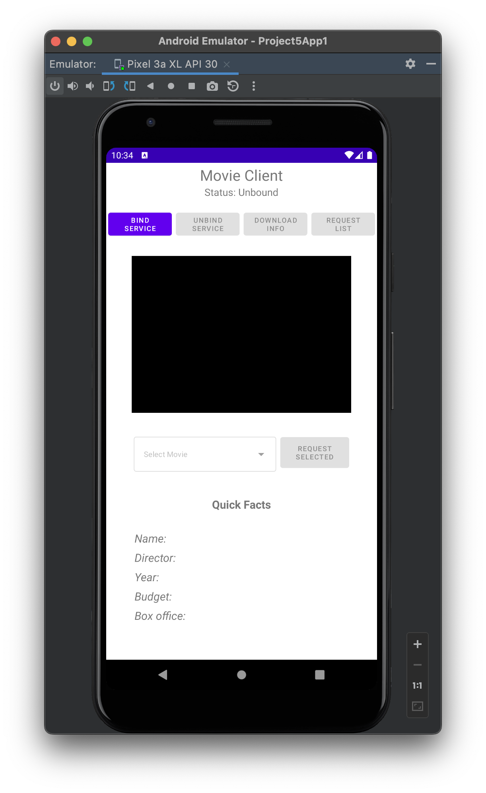

# Movie Client
Android application showcasing trailers for various movies through a binding to a service's API. The application also allows for retrieval of some quick facts from the API (Name, Director, Year, Budget, and Box office) relating to the movies, as well as separate activities which allow for viewing the full list of movies and watching the trailers in an unobstructed view. Created using the Android flavor of Java. CS 478 Project 5, UIC Spring 2022.

## Table of contents
* [General Info](#general-info)
* [Getting Started](#getting-started)
* [Project Requirements](#project-requirements)
* [Technologies](#technologies)
* [Credits](#credits)
* [Visual Demonstration](#visual-demonstration)

## General info
This project is the fifth project for CS 478 (Software Development for Mobile Platforms) at the University of Illinois at Chicago, Spring 2022. Our task was to design and code an Android app comprised of code from two projects meant to work together on an Android device running version Android 11 (API 30). The first project, named MovieCentral, stores information about motion pictures, and exposes a service that supports functionality for downloading information about each movie. The second project, MovieClient, contains a main activity that supports functionality for using the MovieCentral project by starting and binding to its service. **NOTE:** Within this repository, MovieClient's project folder is [Project5App1](Project5App1) and MovieCentral's project folder is [Project5App2](Project5App2).

## Getting Started
If you would like to download the app from the Google Play Store, click **here**. If you would like to browse through the source code in the environment it was created in, make sure you have **Android Studio 2021.1.1** installed.
* Windows: [download here](https://redirector.gvt1.com/edgedl/android/studio/install/2021.1.1.20/android-studio-2021.1.1.20-windows.exe)
* Mac (Intel): [download here](https://redirector.gvt1.com/edgedl/android/studio/install/2021.1.1.20/android-studio-2021.1.1.20-mac.dmg)
* Mac (ARM): [download here](https://redirector.gvt1.com/edgedl/android/studio/install/2021.1.1.20/android-studio-2021.1.1.20-mac_arm.dmg)
* Linux: [download here](https://redirector.gvt1.com/edgedl/android/studio/ide-zips/2021.1.1.20/android-studio-2021.1.1.20-linux.tar.gz)
* Chrome OS: [download here](https://redirector.gvt1.com/edgedl/android/studio/install/2021.1.1.20/android-studio-2021.1.1.20-cros.deb)

Once you are ready, open the project(s) in Android Studio. If you want to simply explore the Movie Client app, open Project5App1. If you would like to view the service code and API of MovieCentral, open up Project5App2. Ensure that the Run/Debug Configurations are set and set the device to a Pixel 3a XL using API 30. MovieCentral has no layout files, it is simply the code for the service in the MovieCentral class and the API within the [MovieAPI.aidl](Project5App2/app/src/main/aidl/com/example/moviecommon/MovieAPI.aidl) file (shared with [Movie Client](Project5App1/app/src/main/aidl/com/example/moviecommon/MovieAPI.aidl)). Movie Client, upon first launch, should load up and look something like this:

 

You can then begin testing Movie Client's features. To begin, press on the ***BIND SERVICE*** button. This will then begin binding to MovieCentral's service through a shared .aidl file. Once the service has been bound to, you can either a) press ***UNBIND SERVICE*** at anytime from here on out to unbind the service and revert the app to its default state, or b) press ***DOWNLOAD INFO***, which will then retrieve all the data necessary to power the app from MovieCentral's API. Once the information has been downloaded, you now have a few different options. You can:

* Select a movie from the dropdown menu located below the video player.
    * This automatically begins trailer playback.
    * Once a movie has been selected, you can press ***REQUEST SELECTED*** to bring about Quick Facts from the movie, retrieved from the MovieCentral API.
* Press ***REQUEST LIST***
    * This brings about the second activity, which simply displays a list of the retrieved movies along with the name of their director.
    * If you press on any of the list items, you will be directed to the third activity, which displays that specific movie's trailer in a full-screen view.

## Project Requirements
**MovieCentral** was required to store information about motion pictures. This information includes for each movie (1) the title of the movie, (2) the name of the movie director, and (3) a string denoting the URL of a web site containing a (short) video clip of the movie. MovieCentral stores information about n movies numbered 1 through n, with n ≥ 5. The app exposes a service that supports functionality for downloading information about each movie. The API of MovieCentral’s service should expose the following 3 pieces of functionality in an appropriate AIDL file: 1) Retrieve all information for all movies stored in the service, 2) Retrieve all information for one specific movie by its number (passed as a parameter), and 3) Retrieve the URL string of the site with the movie’s video file.

**Movie Client** was required to contain a main activity that supports functionality for using the MovieCentral codebase by starting and binding to its service. Once bound to the service, Movie Client can use the service’s API to retrieve information about movies, and allows an interactive user to download information about each movie, display that information, and play the video clip at the URL obtained from MovieCentral. The interactive user of Movie Client’s main activity uses key presses on appropriate buttons to bind and unbind from the service.

### Other Requirements ###
* The status of the service (i.e., whether bound or unbound) should be clearly displayed in the main activity of Movie Client.
* A UI element in the main activity of Movie Client allows the user to select a movie clip from the service if the service is bound.
    * The clip should automatically play within Movie Client.
* When bound to the service, the client can request a list of the movies stored in the service or information about a specific movie.
    * The list of movies is displayed in a ListView of a second activity of Movie Client.
    * For each list item, the following information is displayed: (1) title of movie, and (2) name of the director.
    * A click on a list item starts the playback using the predefined Android class MediaController to manage the playback in a VideoView UI element.
* Use methods startService() and bindService() to start the service and to bind to the service.
* Within Movie Client, use Android’s built-in MediaController to play the clip in a VideoView view.
* Use the AIDL to expose the service’s functionality.
* Ensure that the implementation of the service is thread-safe (access to data structures shared by multiple clients should be protected by suitable mutual exclusion locks).
* Running the app in landscape mode was not required.
    
## Technologies
Project is created with:
* Android Studio Bumblebee 2021.1.1
* Java SE Development Kit (JDK) 11.0.11

## Credits
All credits for the project idea go to Professor Ugo Buy. Credits to some of the [MovieClient.java](Project5App1/app/src/main/java/com/example/project5app1/MovieClient.java) and  [MovieCentral.java](Project5App2/app/src/main/java/com/example/project5app2/MovieCentral.java) codebase also go to Professor Ugo Buy as the beginning template for our project. 

All credits to technologies used are given to their owners and all items specified in their respective licenses are adhered to throughout this project.  

## Visual Demonstration
The following link leads to a visual demonstration of the project.
* https://youtu.be/CzaECngvmzw
